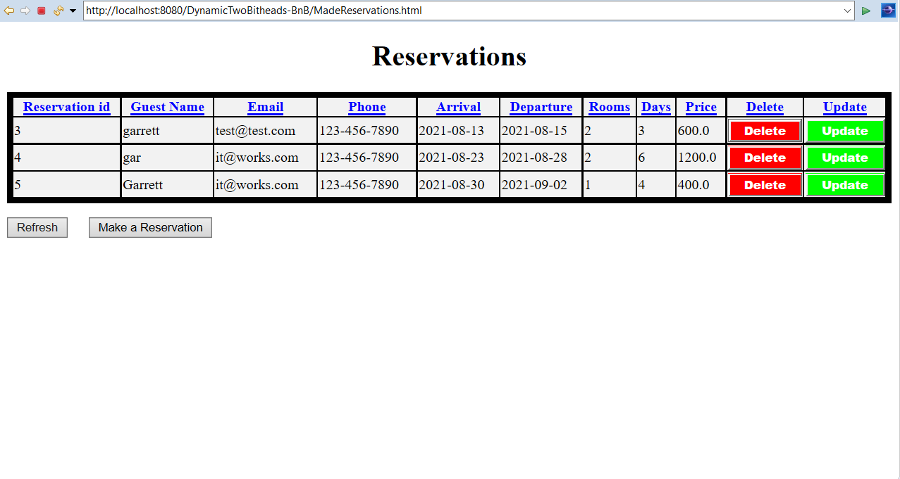

# Dynamic TwoBitheads Bed and Breakfest 
This was a small project that has a create reservation form which will add a reservation to the dockerized container that holds the database. The project also has methods for updating existing reservations or deleting them as well as both a list and a calendar that displays all reservations that have been made and what rooms they have booked.

# Technologies used
This project consisted of a front end of HTML, CSS and JavaScript that handled the UI and most validating on the front end. The front end used JavaScript and HTML forms to send POST's and GET's to the back end to connect to a specific Servlet. The back end Used Java to calculate prices per room and days spent there as well as which rooms where available in the first place by sending transactions to the dockerized database. The back end would send queries to the database and received various data back depending on what it was tasked with doing. The back end would complete any instruction sent from the front end such as delete, update, or create new reservation.

# The Reservation Form
The reservation form is a simple looking page where the user inputs information to submit a reservation. The form has logic that will prevent the user selecting rooms that are already booked for the time period that they wished to stay for. The form also prevents the user from entering a date before the current date since you cannot make reservations for the past. It also prevents the user from selecting a end date that is before the start date.

# The Calendar
The calendar page displays a calendar that show all booked rooms for that month. The user can go to the next month where it will display booked rooms there as well. This was meant for an employee to be able to look at and help a customer book a reservation.

# Made Reservations
The MadeReservations page is where the user can see all made reservations as well as the information about them. They can also update and delete reservations that need to be updated or deleted.

#Bugs and things to be aware of
- If you create a reservation that spans over one month and into the next the calendar will display only the second months rooms as booked and not the first.
- If you enter a end date first or if you change the start date you will be able to choose an end date that is before the start date.
- Using the same trick changing the start and end date range will not reset the rooms that you are able to select.
- When updating a existing reservation you will have to re-enter the rooms that you want otherwise the reservation will be updated with having no rooms.